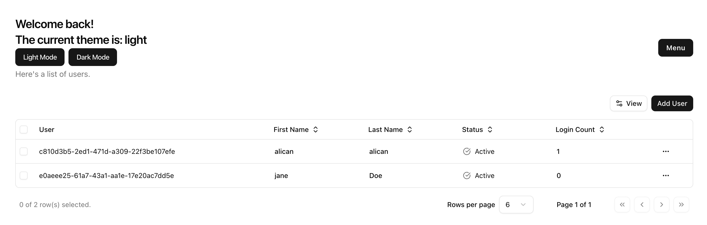

# NestJS CRUD Starter

Please refer to /docs for swagger documentation

### TODOs
- [ ] Unit & e2e Tests
- [x] Logging
- [x] Monitoring
- [ ] Semantic versioning
- [ ] i18n
- [x] Containerization / Docker
- [ ] Deployment script (sst, terraform, pulumi..)
- [ ] Github workflows
- [ ] Update README file

